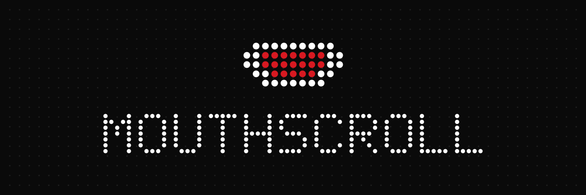

<div align="center">



### SCROLL YOUTUBE WITH YOUR MOUTH. NO HANDS REQUIRED.


</div>

<br>

Open your mouth to skip to the next video. Raise your eyebrows to go back.
Works on YouTube Shorts, Instagram Reels, and normal long YouTube videos.

Everything runs on your own computer. No video ever leaves your browser.

<br>

---

## `01` &nbsp; THE GESTURES

Two gestures. What they do depends on what you're watching.

<table>
<tr>
<td width="50%" valign="top">

**`SHORTS & REELS`**

<kbd>MOUTH</kbd> &nbsp;→&nbsp; Next video

<kbd>BROWS</kbd> &nbsp;→&nbsp; Previous video

</td>
<td width="50%" valign="top">

**`LONG YOUTUBE VIDEOS`**

<kbd>MOUTH</kbd> &nbsp;→&nbsp; Play / pause

<kbd>BROWS</kbd> &nbsp;→&nbsp; Hold to skip +5s

</td>
</tr>
</table>

<kbd>MOUTH</kbd> means open it, then close it. The panel on the page always
shows which mode you're in.

<br>

---

## `02` &nbsp; INSTALL

About three minutes. You only need Google Chrome — no coding, no terminal.

<br>

**`STEP 1`** &nbsp; **Download**

Scroll to the top of this page → click the green **`< > Code`** button →
click **Download ZIP**. It lands in your **Downloads** folder.

<br>

**`STEP 2`** &nbsp; **Unzip**

- **Windows** — right-click the ZIP → **Extract All** → **Extract**
- **Mac** — double-click the ZIP

You now have a folder called **`Youtube-MouthScroll-main`**.

> [!IMPORTANT]
> Don't delete or move this folder after installing. Chrome loads the
> extension from it every time. Drag it somewhere permanent — like Documents —
> before you continue.

<br>

**`STEP 3`** &nbsp; **Open Chrome's extensions page**

Click the puzzle piece **🧩** in the top-right corner → **Manage extensions**.

Or type `chrome://extensions` in the address bar and press Enter.

<br>

**`STEP 4`** &nbsp; **Turn on Developer mode**

Flip the **Developer mode** switch in the **top-right**. Three new buttons
appear at the top-left.

<br>

**`STEP 5`** &nbsp; **Load unpacked**

Click **Load unpacked** → find the folder from Step 2 → open
**`Youtube-MouthScroll-main`** so you can see `manifest.json` inside it →
click **Select Folder** (Windows) or **Select** (Mac).

> [!TIP]
> Pick the folder that *contains* `manifest.json`. If Chrome says
> "Manifest file is missing or unreadable," you picked the wrong one — try one
> level in, or one level out.

Nothing else to download. The face-detection library and its model files are
already in this repo.

<br>

**`STEP 6`** &nbsp; **Pin it** *(optional)*

Click the puzzle piece **🧩** again → click the **pin** icon next to
MouthScroll, so it stays visible in your toolbar.

<br>

---

## `03` &nbsp; USE IT

Go to YouTube Shorts, Instagram Reels, or any YouTube video. A small panel
appears in the bottom-right. Chrome asks for your camera — click **Allow**.

Then start making faces at your screen.

Click the toolbar icon for settings:

| Setting | What it does |
|:--|:--|
| **`ON / OFF`** | Turns MouthScroll off completely, camera included |
| **`SENSITIVITY`** | How wide you have to open your mouth |
| **`BROW SENSITIVITY`** | How far you have to raise your eyebrows |
| **`COOLDOWN`** | How long to wait before it can trigger again |
| **`SHOW CAMERA PREVIEW`** | Show or hide the little camera window |

Your settings are remembered, the ON/OFF switch included. Turn MouthScroll
off and it stays off until you turn it back on.

<br>

---

## `04` &nbsp; TROUBLESHOOTING

| Problem | Fix |
|:--|:--|
| Nothing appears on the page | Refresh the page, then check it's toggled ON in the popup |
| Camera never asked for permission | Click the camera icon **📷** in Chrome's address bar → **Allow** |
| It doesn't notice my face | Put a light in front of you and sit closer to the camera |
| It triggers when I didn't mean to | Drag **Sensitivity** toward **Low**, or **Cooldown** toward **Slow** |
| It ignores me when I open my mouth | Drag **Sensitivity** toward **High** |
| "Manifest file is missing or unreadable" | Wrong folder in Step 5 — pick the one holding `manifest.json` |
| The extension disappeared | You moved or deleted the unzipped folder. Put it back, or redo Step 5 |

<br>

---

## `05` &nbsp; PRIVACY

> [!NOTE]
> There is no server. There is no account. There is nothing to opt out of.

- Face detection runs **entirely on your own computer**, inside your browser.
- **No video, images, or face data are ever sent anywhere.**
- The camera only runs while you're on a supported page with the extension on.
- The only thing stored is your settings, through Chrome's own settings sync.

The extension asks for camera access and permission to run on `youtube.com`
and `instagram.com`. That is the full extent of what it can reach — see
[manifest.json](manifest.json).

<br>

---

## `06` &nbsp; FOR DEVELOPERS

Plain JavaScript. No build step, no bundler, no npm packages.

| File | Purpose |
|:--|:--|
| `manifest.json` | Extension manifest — Chrome Manifest V3 |
| `content.js` | Face tracking, gesture state machines, page overlay |
| `content.css` | Overlay styling |
| `popup.*` | Toolbar settings panel |
| `background.js` | Service worker — default settings, SPA navigation events |
| `gen_icons_node.js` | Generates `icons/` |
| `gen_banner_node.js` | Generates the banner at the top of this file |
| `download_models.js` | Re-downloads face-api.js and its weights |
| `libs/`, `models/` | Vendored face-api.js and weights, committed on purpose |

```bash
node gen_icons_node.js           # regenerate icons/
node gen_icons_node.js --ascii   # preview the icon glyph as text
node gen_banner_node.js          # regenerate assets/banner.png
node download_models.js          # re-fetch libs/ and models/
```

Detection uses face-api.js `TinyFaceDetector` + `FaceLandmark68TinyNet`.
Mouth openness and brow raise are both normalised against eye-corner distance,
so they hold up as you move nearer to or further from the camera.

More in [SETUP.md](SETUP.md). Contributions welcome —
see [CONTRIBUTING.md](CONTRIBUTING.md).

<br>

---

<div align="center">
<br>

**[MIT](LICENSE)** &nbsp;·&nbsp; Do what you like with it.

<br>
</div>
